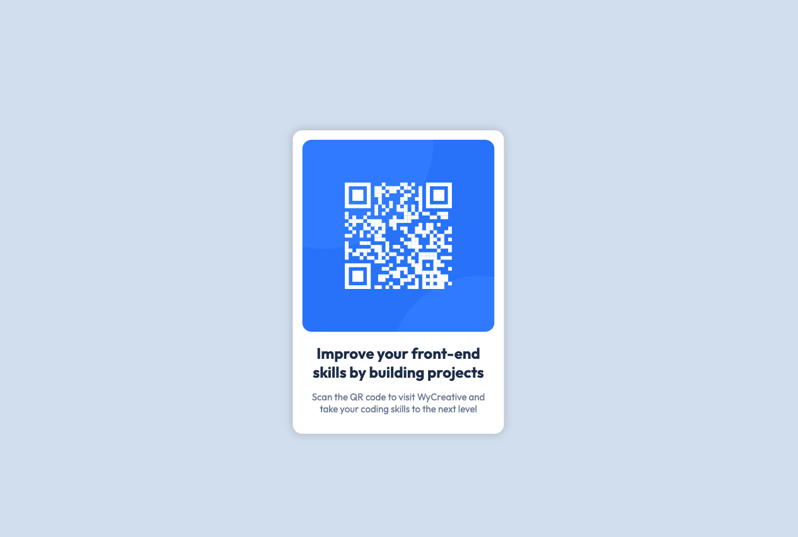

# Frontend Mentor - QR code component solution

This is a solution to the [QR code component challenge on Frontend Mentor](https://www.frontendmentor.io/challenges/qr-code-component-iux_sIO_H). Frontend Mentor challenges help you improve your coding skills by building realistic projects. 

## Table of contents

- [Overview](#overview)
  - [Screenshot](#screenshot)
  - [Links](#links)
- [My process](#my-process)
  - [Built with](#built-with)
  - [What I learned](#what-i-learned)
  - [Continued development](#continued-development)
  - [Useful resources](#useful-resources)
- [Author](#author)


## Overview

### Screenshot



### Links

- Solution URL: [Add solution URL here](https://www.frontendmentor.io/solutions/qr-code-component-pH5X5wOa8V)

## My process

### Built with

- Semantic HTML5 markup
- CSS custom properties

### What I learned

Used this project just to refresh my memory on basic HTML and CSS. Use as you wish.
The challenge in itself does not tell you to use animations, or click events. But I've decided to do these things as they are good practice.


Code Snippets:


```html
<a href="https://www.wygroup.net/" target="_blank">
```

```css (Learned a good way to center a div here)
.QRCode {
    padding: 15px;
    width: 305px;
    height: auto;
    background-color: white;
    box-shadow: 0 0 15px 0 rgba(0, 0, 0, 0.2);
    transform: translate(-50%,-50%);
    position: absolute;
    top:50%;
    left:50%;
    text-align: center;
    justify-content: center;
    border-radius: 15px;
    transition: transform 250ms ease-in-out;
}
```

### Continued development

Will probably keep on working on some of these challenges.

### Useful resources

- [joshwcomeau CSS-Transitions](https://www.joshwcomeau.com/animation/css-transitions/) - This is a great example on how to work with animations and transitions using CSS.
- [MDN Borders](https://developer.mozilla.org/en-US/docs/Web/CSS/border-radius) - Great resource for CSS borders. I'd recommend it to anyone still learning this concept.

## Author

- Frontend Mentor - [@andrecaldeiras](https://www.frontendmentor.io/profile/andrecaldeiras)
